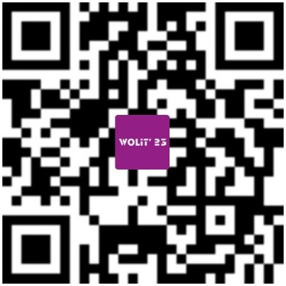

In 2023, WOLIT’23 will take place on-site and registration for WOLIT’23 will begin on June 3, 2023.  

2023年，WOLIT’23 将会以全线下相结合的方式开展，注册页面将于2023年6月3日开放。  

## How to Register 如何注册
### ● Step1 第一步  
Please scan the QR code below or click the [URL link](https://www.wenjuan.com/s/zuEVrqQ/#) to complete the online registration.   
Once the review is completed, the organizing committee will send a confirmation email to the registrant within 3-5 working days. The total registration fee and payment method will be instructed.  
请扫描下方二维码或点击 [本链接](https://www.wenjuan.com/s/zuEVrqQ/#) 来完成在线注册申请。信息审核通过后，组委会在3-5个工作日内将确认邮件发送到注册者所提供的邮箱。注册费用的总金额以及付款方式会在确认邮件里说明。  

### ● Step2 第二步  
Please make an offline transfer according to the total registration fee in the confirmation email to the following account:   
请根据确认邮件里的总注册费金额进行线下转账到以下账号：  
> Bank Account's Name: <u>深圳市干部人才健康管理中心（深圳市人才研修院）</u>  
  Bank Account’s Number: <u>755961684710706</u>  
  Bank Name: <u>招商银行深圳分行营业部</u>  

### ● Step3 第三步
Please send your electronic remittance receipt by email with subject "WOLIT23+your full name (Chinese)" to [tianbingzi@sz.tsinghua.edu.cn](mailto:tianbingzi@sz.tsinghua.edu.cn).  

将您的电子汇款回执发送到[tianbingzi@sz.tsinghua.edu.cn](mailto:tianbingzi@sz.tsinghua.edu.cn)，并在邮件标题里注明“WOLIT23+您的全名（中文）”。

## Registration Fees 注册费
You can choose the specific date(s) you would like to attend when register and please note the registration fees has include lunch, coffee break and workshop materials.  
您在注册时可以选择您想要参加的日期，注册费包括当天的午餐和茶歇以及活动物料。  



## Useful Info 实用信息
### ● Hotels Nearby 附近的酒店  
Here are some hotels nearby that attendees can book on their own:  
以下是推荐的一些会议场地附近的酒店，参会者可自行预定： 
 
- Jinbaihe Hotel 金百合酒店  
Double-bed room: CNY 488 per night  
To the Venue: 2.3km  
[site](https://www.trip.com/hotels/shenzhen-hotel-detail-1571226/jinbaihe-hotel/)  

- Lavande Hotel (Shezhen University Town Metro Station) 麗枫酒店(深圳大学城地铁站店)  
One-bed room: CNY 320 per night  
Double-bed room: CNY 330 per night  
To the Venue: 4.0km  
[site](https://www.trip.com/hotels/shenzhen-hotel-detail-4500487/lavande-hotel-shezhen-university-town-metro-station/)  

- Jingfeng Hotel 璟峯酒店  
One-bed room: CNY 450 per night  
Double-bed room: CNY 450 per night  
To the Venue: 4.1km  
[site](https://us.trip.com/hotels/shenzhen-hotel-detail-71670993/jingfeng-hotel/)  

- Helen Tara Boutique Hotel 深圳海伦塔纳精品酒店  
One-bed room: CNY 380 per night  
Double-bed room: CNY 380 per night  
To the Venue: 4.4km  
[site](https://www.trip.com/hotels/shenzhen-hotel-detail-45925270/helen-tara-boutique-hotel/)  

- Changshang Nordic Hotel (Xili Metro Station) 常尚北欧酒店（西丽地铁站店）  
One-bed room: CNY 350 per night  
Double-bed room: CNY 370 per night  
To the Venue: 5.0km  
[site](https://hotels.ctrip.com/hotels/74974.html)  

- Vienna Best Sleep International Hotel (Tanglang Metro Station) 维也纳好眠国际酒店（深圳塘朗地铁站）  
One-bed room: CNY 470 per night  
Double-bed room: CNY 470 per night  
To the Venue: 8.2km  
[site](https://www.trip.com/hotels/shenzhen-hotel-detail-42823372/vienna-best-sleep-international-hotel/)  
